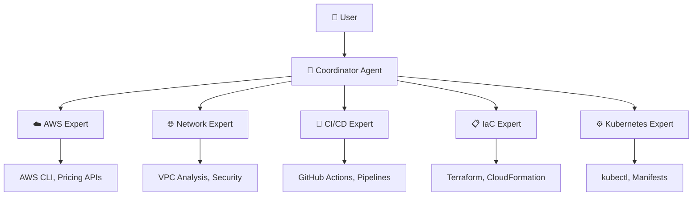

# 🤖 Strands Agents Ecosystem

> **A comprehensive multi-agent coordination system built with the Strands framework, demonstrating advanced "Agents as Tools" patterns for solving complex cloud engineering problems.**

[](https://opensource.org/licenses/MIT)
[](https://www.python.org/downloads/)
[](https://github.com/strands-ai/strands)

## 🎯 **What is this?**

This project showcases how to build sophisticated **multi-agent systems** using the Strands framework. Instead of having a single AI agent try to solve everything, we coordinate multiple specialized agents that work together like a professional team.

**Perfect for learning:**

- 🧠 Multi-agent coordination patterns
- 🔧 "Agents as Tools" architecture
- 🌐 Cloud engineering automation
- 🚀 Real-world AI agent applications

## 🏗️ **Architecture Overview**



### **How it works:**

1. **User** asks a complex question like _"Design a scalable web application architecture"_
2. **Coordinator** analyzes the request and determines which specialists are needed
3. **Specialists** are invoked as tools to provide expert knowledge in their domains
4. **Coordinator** synthesizes all responses into a comprehensive solution

## 🚀 **Quick Start**

### **Prerequisites**

- Python 3.9 or higher
- AWS account (for cloud-related queries)
- Basic understanding of cloud concepts

### **Installation**

1. **Clone the repository:**

   ```bash
   git clone https://github.com/4l3j4ndr0/strands-agents-ecosystem.git
   cd strands-agents-ecosystem
   ```

2. **Create virtual environment:**

   ```bash
   python -m venv venv
   source venv/bin/activate  # On Windows: venv\Scripts\activate
   ```

3. **Install dependencies:**

   ```bash
   pip install -r requirements.txt
   ```

4. **Configure environment:**

   ```bash
   cp .env.example .env
   # Edit .env with your AWS credentials and preferences
   ```

5. **Run the system:**
   ```bash
   python main.py
   ```

## ⚙️ **Configuration**

### **Environment Variables**

| Variable                   | Description             | Default                                      | Required |
| -------------------------- | ----------------------- | -------------------------------------------- | -------- |
| `AWS_REGION`               | AWS region to use       | `us-east-1`                                  | ✅       |
| `AWS_PROFILE`              | AWS profile to use      | `default`                                    | ❌       |
| `MODEL_ID`                 | Bedrock model ID to use | `us.anthropic.claude-sonnet-4-20250514-v1:0` | ❌       |
| `ENABLE_TOOL_INTERCEPTION` | Ask before using tools  | `true`                                       | ❌       |
| `LOG_LEVEL`                | Logging verbosity       | `INFO`                                       | ❌       |
| `DEBUG_MODE`               | Enable debug mode       | `false`                                      | ❌       |

### **Model Providers**

The system uses AWS Bedrock by default with Claude 4 Sonnet. You can customize the model by setting the `MODEL_ID` environment variable to any supported Bedrock model ID.

## 🎮 **Usage Examples**

### **Example 1: Architecture Design**

```
Query: Design a serverless web application with user authentication

🔄 Processing your query...
════════════════════════════════════════════════════════════

🔧 Consultando especialista: AWS Expert
--------------------------------------------------
🔧 CONFIRMACIÓN DE HERRAMIENTA
════════════════════════════════════════════════════════════
El agente quiere: consultar al especialista en AWS
Herramienta: aws_expert_tool
Parámetros: query: Design serverless web application...
════════════════════════════════════════════════════════════
¿Continuar? [s/n/a/t]: s

✅ Usando aws_expert_tool...
⚡ Procesando...

**Resumen de Consulta:**
Consulté al especialista en AWS para diseñar una arquitectura serverless completa con autenticación.

**Especialistas Consultados:**
AWS Expert

**Respuesta:**
For a serverless web application with authentication, I recommend:

🏗️ **Architecture Components:**
- **Frontend**: S3 + CloudFront for static hosting
- **Authentication**: AWS Cognito User Pools
- **API**: API Gateway + Lambda functions
- **Database**: DynamoDB for user data
- **Storage**: S3 for file uploads

🔧 **Implementation Steps:**
1. Set up Cognito User Pool with email verification
2. Create Lambda functions for business logic
3. Configure API Gateway with Cognito authorizer
4. Deploy frontend to S3 with CloudFront distribution

**¿Necesitas más detalles?**
Si requieres información más específica sobre algún aspecto, por favor indícamelo.
```

### **Example 2: Infrastructure as Code**

````
Query: Create Terraform code for the above architecture

🔧 Consultando especialista: IaC Expert
[Tool confirmation dialog...]

**Respuesta:**
Here's the Terraform code for your serverless architecture:

```hcl
# Cognito User Pool
resource "aws_cognito_user_pool" "main" {
  name = "webapp-users"

  password_policy {
    minimum_length    = 8
    require_lowercase = true
    require_numbers   = true
    require_symbols   = true
    require_uppercase = true
  }
}

# API Gateway
resource "aws_api_gateway_rest_api" "main" {
  name        = "webapp-api"
  description = "Serverless web application API"
}

# Lambda function
resource "aws_lambda_function" "api" {
  filename         = "api.zip"
  function_name    = "webapp-api"
  role            = aws_iam_role.lambda_role.arn
  handler         = "index.handler"
  runtime         = "python3.9"
}
````

```

### **Example 3: Multi-Agent Coordination**
```

Query: I need a complete DevOps pipeline for a React app deployed to EKS

[System coordinates multiple agents:]

- CI/CD Expert: Creates GitHub Actions workflow
- Kubernetes Expert: Designs EKS deployment manifests
- IaC Expert: Provides Terraform for infrastructure
- AWS Expert: Recommends best practices and services
- Coordinator: Synthesizes everything into a complete solution

````

## 🔧 **Tool Interception System**

One of the unique features of this system is **tool interception** - you can see and approve every action before agents execute them.

### **How it works:**

1. Agent decides to use a tool (e.g., read a file, call AWS API)
2. System shows you what the agent wants to do
3. You approve or deny the action
4. Agent proceeds based on your decision

### **Approval Options:**

- **[s]** - Yes, use this tool once
- **[n]** - No, skip this tool
- **[a]** - Approve all tools for this session
- **[t]** - Approve this tool type for the session

### **Control Commands:**

- `intercept on` - Enable tool interception
- `intercept off` - Disable tool interception (auto-approve)
- `help` - Show help information
- `quit` - Exit the system

## 🏛️ **Agent Specializations**

### **🎯 Coordinator Agent**
- **Role**: Orchestrates multi-agent workflows
- **Capabilities**: Query analysis, agent selection, response synthesis
- **When used**: Every query (entry point)

### **☁️ AWS Expert Agent**
- **Role**: Cloud architecture and AWS services specialist
- **Capabilities**: Service recommendations, architecture design, best practices
- **When used**: AWS-related queries, cloud architecture questions

### **🌐 Networking Expert Agent**
- **Role**: Network architecture and connectivity specialist
- **Capabilities**: VPC design, security groups, routing, connectivity
- **When used**: Network design, connectivity issues, security questions

### **🔄 CI/CD Expert Agent**
- **Role**: Continuous integration and deployment specialist
- **Capabilities**: GitHub Actions, pipeline design, deployment strategies
- **When used**: DevOps workflows, automation, deployment questions

### **📋 IaC Expert Agent**
- **Role**: Infrastructure as Code specialist
- **Capabilities**: Terraform, CloudFormation, infrastructure automation
- **When used**: Infrastructure provisioning, IaC best practices

### **⚙️ Kubernetes Expert Agent**
- **Role**: Container orchestration specialist
- **Capabilities**: EKS, manifests, deployments, scaling
- **When used**: Container deployments, Kubernetes questions

## 🛠️ **Development**

### **Project Structure**

strands-agents-ecosystem/
├── agents/ # Individual agent implementations
│ ├── coordinator/ # Main orchestrator agent
│ ├── aws_expert/ # AWS specialist agent
│ ├── networking/ # Network specialist agent
│ ├── cicd/ # CI/CD specialist agent
│ ├── iac/ # Infrastructure as Code agent
│ └── kubernetes/ # Kubernetes specialist agent
├── common/ # Shared utilities and tools
│ ├── tools/ # Custom tools for agents
│ └── utils/ # Helper functions and utilities
├── orchestrator/ # Agent coordination logic
├── config/ # Configuration management
├── main.py # Application entry point
├── requirements.txt # Python dependencies
└── .env.example # Environment configuration template


### **Adding New Agents**

1. **Create agent directory:**
   ```bash
   mkdir agents/new_agent
````

2. **Implement agent files:**

   ```python
   # agents/new_agent/agent.py
   from strands import Agent
   from .prompts import NEW_AGENT_SYSTEM_PROMPT

   new_agent = Agent(
       system_prompt=NEW_AGENT_SYSTEM_PROMPT,
       tools=[],  # Add relevant tools
   )
   ```

3. **Add to main system:**

   ```python
   # main.py
   from agents.new_agent.agent import new_agent

   agents = {
       # ... existing agents
       "new_agent": new_agent,
   }
   ```

### **Custom Tools**

Create custom tools in `common/tools/`:

```python
from strands import tool

@tool
def my_custom_tool(parameter: str) -> str:
    """Description of what this tool does."""
    # Tool implementation
    return result
```

## 🤝 **Contributing**

We welcome contributions! Here's how you can help:

### **Ways to Contribute:**

1. **🐛 Bug Reports**: Found an issue? Open a GitHub issue
2. **💡 Feature Requests**: Have an idea? We'd love to hear it
3. **📝 Documentation**: Help improve our docs
4. **🔧 Code**: Submit pull requests for new features or fixes
5. **🎓 Examples**: Share interesting use cases and examples

### **Development Setup:**

1. Fork the repository
2. Create a feature branch: `git checkout -b feature/amazing-feature`
3. Make your changes
4. Add tests if applicable
5. Commit your changes: `git commit -m 'Add amazing feature'`
6. Push to the branch: `git push origin feature/amazing-feature`
7. Open a Pull Request

### **Code Style:**

- Follow PEP 8 for Python code
- Add docstrings to all functions and classes
- Include type hints where appropriate
- Write clear, descriptive commit messages

## 🔍 **Troubleshooting**

### **Common Issues:**

**Q: "ModuleNotFoundError: No module named 'strands'"**

```bash
# Solution: Install the required dependencies
pip install -r requirements.txt
```

**Q: "AWS credentials not found"**

```bash
# Solution: Configure your AWS credentials
aws configure
# Or set environment variables in .env file
```

**Q: "Agent not responding"**

```bash
# Solution: Check your model configuration
# Ensure MODEL_ID is correct in .env file
```

**Q: "Tool interception not working"**

```bash
# Solution: Check environment variable
export ENABLE_TOOL_INTERCEPTION=true
```

### **Getting Help:**

1. Check the [Issues](https://github.com/4l3j4ndr0/strands-agents-ecosystem/issues) page
2. Read the [Strands Documentation](https://strandsagents.com/latest/)

## 📄 **License**

This project is licensed under the MIT License - see the [LICENSE](LICENSE) file for details.

## 🙏 **Acknowledgments**

- **Open Source Community** - For inspiration and contributions
- **AWS** - For providing excellent cloud services and documentation
- **Contributors** - Everyone who helps make this project better

## 🌟 **Star History**

If you find this project helpful, please consider giving it a star! ⭐

---

**Built with ❤️ by Alejandro Castañeda Ocampo**

_Ready to build your own multi-agent system? Start with this ecosystem and customize it for your needs!_
